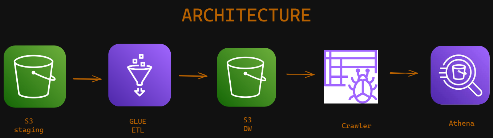
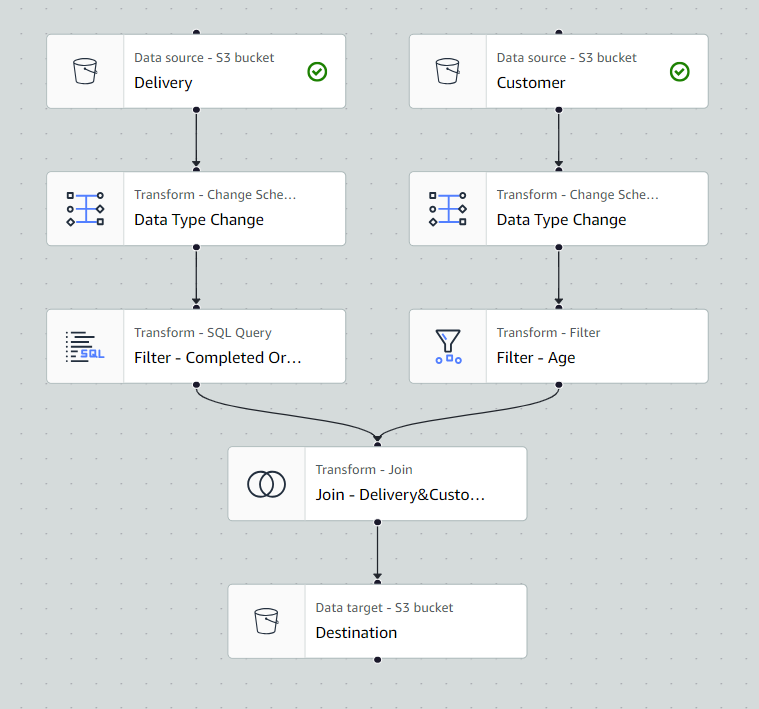

# AWS Glue Project

### Introduction
This project involves processing customer and delivery datasets using AWS Glue for ETL (Extract, Transform, Load) operations. The datasets are manually uploaded to an S3 bucket named `staging`. The cleaned and transformed data is then uploaded to another S3 bucket, `datawarehouse`. A crawler is used to create tables from the cleaned data, and SQL queries are performed using AWS Athena.

The project involves the following steps:
1. Uploading the delivery and customer datasets to the AWS S3 `staging` bucket.
2. Performing necessary data type adjustments for the dataset columns.
3. Transforming the delivery dataset to show only completed orders using SQL queries.
4. Filtering out outliers in the age column of the customer dataset.
5. Joining and cleaning the datasets.
6. Uploading the cleaned data to the `datawarehouse` S3 bucket.

### Tools
- **AWS S3**: For storing raw and processed data.
- **AWS Glue**: For ETL operations.
- **AWS Athena**: For running SQL queries on the transformed data.

### Prerequisites
- An AWS account with appropriate permissions for S3, Glue, and Athena.
- AWS CLI configured on your local machine.
- Basic knowledge of SQL and ETL processes.

### Setup Instructions
1. **Upload Datasets**:
   - Manually upload the delivery and customer datasets to the `staging` S3 bucket.

2. **Create AWS Glue Jobs**:
   - Create a Glue job to adjust data types of the dataset columns.
   - Create a Glue job to transform the delivery dataset, filtering for completed orders.
   - Create a Glue job to filter out outliers in the age column of the customer dataset.

3. **Join and Clean Data**:
   - Create a Glue job to join the transformed delivery dataset with the cleaned customer dataset.
   - Upload the cleaned and joined data to the `datawarehouse` S3 bucket.

4. **Create AWS Glue Crawler**:
   - Set up a crawler to crawl the `datawarehouse` S3 bucket and create tables in the Glue Data Catalog.

5. **Run Queries in Athena**:
   - Use AWS Athena to run SQL queries on the tables created by the crawler.

### Detailed Steps
1. **Data Type Adjustments**:
   - Use Glue's transformation capabilities to adjust the data types of the columns in the delivery and customer datasets as needed.

2. **Transform Delivery Dataset**:
   - Apply SQL queries within a Glue job to filter the delivery dataset to only include completed orders.

3. **Filter Customer Dataset**:
   - Remove outliers in the age column of the customer dataset using Glue transformations.

4. **Join Datasets**:
   - Perform a join operation on the delivery and customer datasets to combine relevant information.

5. **Upload to Datawarehouse**:
   - Once the data is cleaned and transformed, upload it to the `datawarehouse` S3 bucket for further analysis.

6. **Create and Run Crawler**:
   - Configure and run a Glue crawler to catalog the cleaned data stored in the `datawarehouse` S3 bucket.

7. **Query with Athena**:
   - Utilize AWS Athena to perform SQL queries on the cataloged data for analysis and reporting purposes.